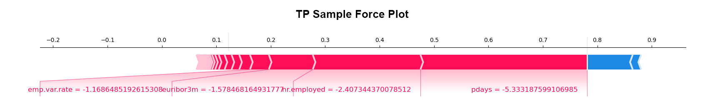

# Long-Term Deposits Telemarketing Dataset Mining

## Introduction

The project involves creating the prediction model of a data-driven decision support system for targetted marketing of long-term deposits. It is based on the UCI Bank Marketing dataset [\[1\]](#references).

## Dataset exploration

The dataset consists of real data collected from a Portugese retail bank between May 2008 and June 2013; the marketing campaign involved the bank making offers to clients to invest in long-term deposits by phone call. Practical usage of the model predictions needs to take into account the effects of the global economic crisis that peaked in 2008 (precisely at the beginning of the data collection process) - this has mainly turned clients to savings.

The original paper claims 52.944 phone contacts, 12.38% of which were successful, whereas the provided dataset contains 41.188 samples. Each sample includes the offer outcome - success or failure, and in total 20 features of the client that belong in the following broader categories: telemarketing attributes, product details, client demographic information, social and economic influence features; details are provided in `dataset/bank-additional-names.txt`. Feature selection has already been made on the original collected data and its result are the variables comprising the dataset. For more details, see the original research paper [\[2\]](#references), section 2.1 for data collection and section 2.4 for feature selection.

## Predictive modeling

### Data preprocessing

The original dataset is randomly partitioned 90% - 10% into training and test data. As the training data is large and the model creation for at least some of the utilized algorithms is computationally intensive, a random 15% of the training data is extracted into a separate set used for model selection and model evaluation. The final models are built on the entire training data using the parameters that resulted from the selection. The original UCI dataset is provided in the `dataset` directory, while the datasets generated as described for the purposes of this project are located in the `implementation/data` directory.

There is some missing data in the original dataset only for categorical features. The missing values are encoded using "unknown", which is treated as a separate class.

### Data transformation

The numerical features are standardized when the dataset is loaded. The categorical features are being one hot encoded, i.e. replaced with dummy variables, since most of the selected algorithms do not support categorical data, and even in the cases that in theory they do, the sklearn implementations do not support it. A dimensionality reduction transformation had been made before the data was used in the algorithms - this is a PCA transformation for the data for each algorithm except for PLS-DA, which does its own transformation. The first 27 PCA components explain little over 95% of the variance, and yield an increase in the dimensionality from the original 20 features, but a great reduction from the 63 that resulted from the one-hot encoding of the categorical features.

Feature selection is not performed over the dataset as it has already been made by its authors when composing it.

### Model selection

The created classifiers are based on the following algorithms: Logistic Regression, Gradient Boosted Decision Trees, Random Forests, Partial Least Squares - Discriminant Analysis, K Nearest Neighbors, Support Vector Machines, and an ensemble of Neural Networks.

K-fold cross validation was used for hyperparameter tuning with a grid search for each algorithm except for the NN ensemble, with K being 10; the AUC metric is what is optimized (the rationale is provided in the following section). Due to the computational intensity of the algorithms, the CV procedure was not repeated for lowering the variance of the estimate (rather, repetition is not built in the implementation, but upon selecting the final resulting values the procedure was repeated manually).

In LR the regularization parameter C is set to 5; this parameter is inversely proportional to λ, hence larger values overfit and smaller underfit.

For GBDT and RF the number of trees hyperparameter was selected by balancing the minimization of the number of trees and the maximization of AUC - trees were added as long as this produces a significant increase in the AUC (improvements of order not lesser than 10-1 were considered significant).

In the case GBDT the selected number of trees was 150 and the learning rate was 0.1.

For RF the selected number of trees was 150 and in addition other hyperparameters were optimized: max_depth = 16, min_samples_split = 22, min_samples_leaf = 10; the [sklearn algorithm documentation](https://scikit-learn.org/stable/modules/generated/sklearn.ensemble.RandomForestClassifier.html) elaborates on their meaning.

The number of components kept for PLS-DA was 6; the selection was made using the CV procedure, preferring larger AUC and fewer components.

In kNN the selected value of k, the number of nearest neighbors, was 5.

For SVM the regularization parameter C was set to 5; as with the LR model, this parameter is inversely proportional to λ.

As for the NN ensemble, the choices and heuristics of [\[2\]](#references) were largely adopted as is: each fully-connected feed-forward neural network contains a single hidden layer, the number of nodes per hidden layer was set at two thirds the number of features, which equals 18 since the PCA-transformed data was used here, and the number of training epochs was 100. The predictions by each such network would have high variance, hence the need for an ensemble; it consists of 7 networks, as is the case in the referenced research.

### Model evaluation

For each algorithm the model performance is reported on a train-test partition of the full dataset; comparing the performance metrics on the training and test data yields some insight into the degree of model overfitting.

<table>
	<tr>
		<td></td>
		<td colspan="5" align="center">Training</td>
		<td colspan="5" align="center">Test</td>
 	</tr>
	<tr>
		<td></td>
		<td align="center">TP</td>
		<td align="center">TN</td>
		<td align="center">FP</td>
		<td align="center">FN</td>
		<td align="center">AUC</td>
		<td align="center">TP</td>
		<td align="center">TN</td>
		<td align="center">FP</td>
		<td align="center">FN</td>
		<td align="center">AUC</td>
 	</tr>
	<tr>
		<td>LR</td>
		<td align="center">1718</td>
		<td align="center">32022</td>
		<td align="center">849</td>
		<td align="center">2481</td>
		<td align="center">0.6917</td>
		<td align="center">201</td>
		<td align="center">3579</td>
		<td align="center">98</td>
		<td align="center">240</td>
		<td align="center">0.7146</td>
 	</tr>
	<tr>
  		<td>PLS-DA</td>
   		<td align="center">1350</td>
		<td align="center">32201</td>
		<td align="center">670</td>
		<td align="center">2849</td>
		<td align="center">0.6506</td>
		<td align="center">162</td>
		<td align="center">3612</td>
		<td align="center">65</td>
		<td align="center">279</td>
		<td align="center">0.6748</td>
 	</tr>
 	<tr>
  		<td>GBDT</td>
   		<td align="center">2191</td>
		<td align="center">31969</td>
		<td align="center">902</td>
		<td align="center">2008</td>
		<td align="center">0.7472</td>
		<td align="center">228</td>
		<td align="center">3556</td>
		<td align="center">121</td>
		<td align="center">213</td>
		<td align="center">0.7420</td>
 	</tr>
	<tr>
  		<td>RF</td>
   		<td align="center">2519</td>
		<td align="center">32543</td>
		<td align="center">328</td>
		<td align="center">1680</td>
		<td align="center">0.7950</td>
		<td align="center">192</td>
		<td align="center">3583</td>
		<td align="center">94</td>
		<td align="center">249</td>
		<td align="center">0.7049</td>
 	</tr>
	<tr>
  		<td>kNN</td>
   		<td align="center">2320</td>
		<td align="center">32075</td>
		<td align="center">796</td>
		<td align="center">1879</td>
		<td align="center">0.7641</td>
		<td align="center">202</td>
		<td align="center">3547</td>
		<td align="center">130</td>
		<td align="center">239</td>
		<td align="center">0.7113</td>
 	</tr>
	<tr>
  		<td>SVM</td>
   		<td align="center">2404</td>
		<td align="center">32373</td>
		<td align="center">498</td>
		<td align="center">1795</td>
		<td align="center">0.7787</td>
		<td align="center">209</td>
		<td align="center">3577</td>
		<td align="center">100</td>
		<td align="center">232</td>
		<td align="center">0.7234</td>
 	</tr>
	<tr>
  		<td>NNs</td>
   		<td align="center">2389</td>
		<td align="center">31767</td>
		<td align="center">1104</td>
		<td align="center">1810</td>
		<td align="center">0.7677</td>
		<td align="center">241</td>
		<td align="center">3536</td>
		<td align="center">141</td>
		<td align="center">200</td>
		<td align="center">0.7542</td>
 	</tr>
</table>

The AUC metric is used for estimating model performance, following the example of the original research - section 2.3 of [\[2\]](#references). In addition the elements of the confusion matrix are provided so that other metrics could be calculated. The reasoning for opting to use this metric is that it is invariant of the class frequency and features a balanced penalization of the two different misclassifications. The former is not valid for the accuracy metric as a quotient of true predictions and total predictions, and the class frequencies are unbalanced in the dataset.

While some of the models perform significantly better on the training data, the test results are satisfactory in comparison; specifically, reducing the imbalance (with stronger regularization, for example) would likely also reduce the performance on the test set, since it was the estimated loss on the test set that was minimized in model tuning.

## Knowledge discovery

How the outcome models make predictions based on the underlying data is not readily understandable due to their inherent complexity. There are several options for knowledge discovery.

In the original research paper [\[2\]](#references) a sensitivity analysis has been made, and also a Decision Tree (a readily understandable model) has been trained to predict the responses of the best model with high accuracy.

Since this is a binary classification problem and PCA analysis has been performed, provided that some component(s) explain a comparatively large portion of the variance and simultaneously split the samples belonging to different class, then correlation between the features having extreme loadings on those components and the outcome classes could be established. No such PCA components exist for the current dataset, which is to be expected since even the best prediction techniques which create highly-nonlinear separating boundaries in the data space, like SVM and the NNs, were unable to completely split the classes.

This project uses [SHAP](https://github.com/slundberg/shap), in particular its KernelExplainer on the NN ensemble, which is the best-performing model. Provided below are force plots for a single true positive and a single true negative sample from the test dataset, which illustrate which features affect the predictions the most; the reported target value is the predicted probability for the "yes" class.

A summary plot has been generated on 100 samples from the test set; it calculates the involvement of each feature in generating the prediction outcomes:

The SHAP results yield insight into the workings of the selected prediction model and could be used as a starting point for causal inference.

## Conclusion

The categorical features of the original dataset were one-hot encoded and PCA was performed to reduce the dimensionality from the resulting 63 features to 27. Several algorithms were used for predictive modeling: Logistic Regression, Partial Least Squares - Discriminant Analysis, Gradient Boosted Decision Trees, Random Forests, k-Nearest Neighbors, Support Vector Machines and Neural Network. Model hyperparameter tuning was performed using grid search in conjunction with 10-fold cross validation on the training data. The resulting NN ensemble provides the best performance among the created models yielding an AUC value of 0.7542 on the test data, the weakest performing model yields an AUC of 0.6748. SHAP, specifically its KernelExplainer, was utilized for gaining understanding of the workings of the best-performing model.

## References

1. Dua, D. and Graff, C. (2019). UCI Machine Learning Repository: Bank Marketing Data Set \[https://archive.ics.uci.edu/ml/datasets/Bank+Marketing\]. Irvine, CA: University of California, School of Information and Computer Science.

2. \[Moro et al., 2014\] S. Moro, P. Cortez and P. Rita. A Data-Driven Approach to Predict the Success of Bank Telemarketing. Decision Support Systems, Elsevier, 62:22-31, June 2014
